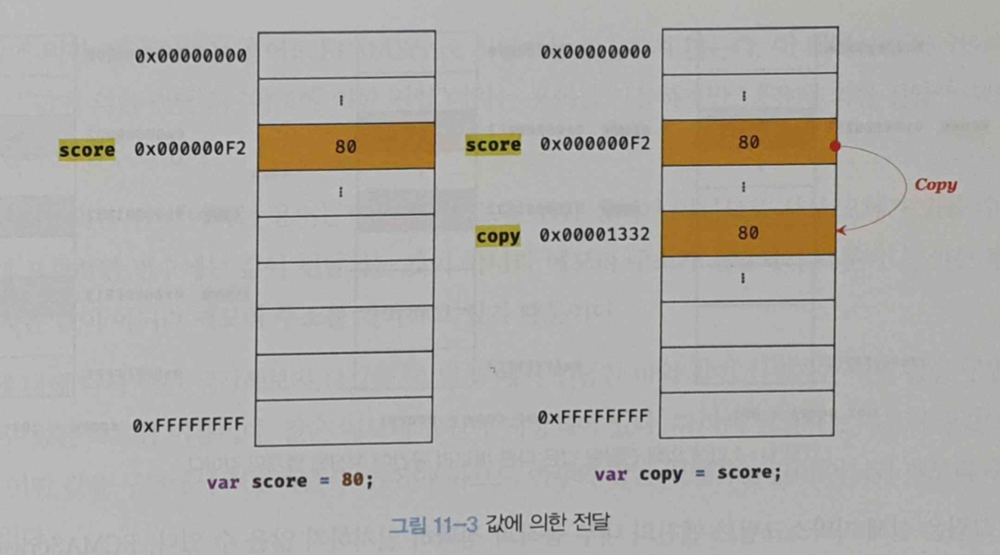
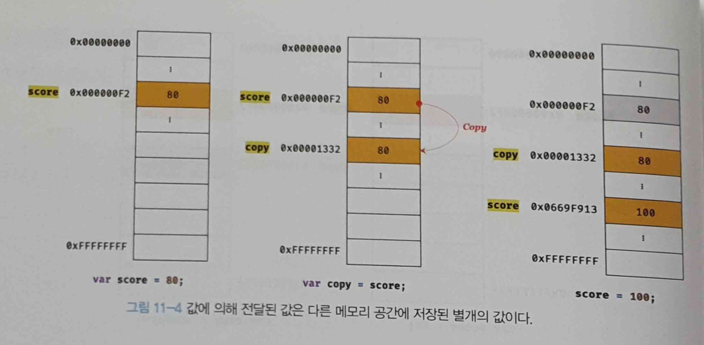
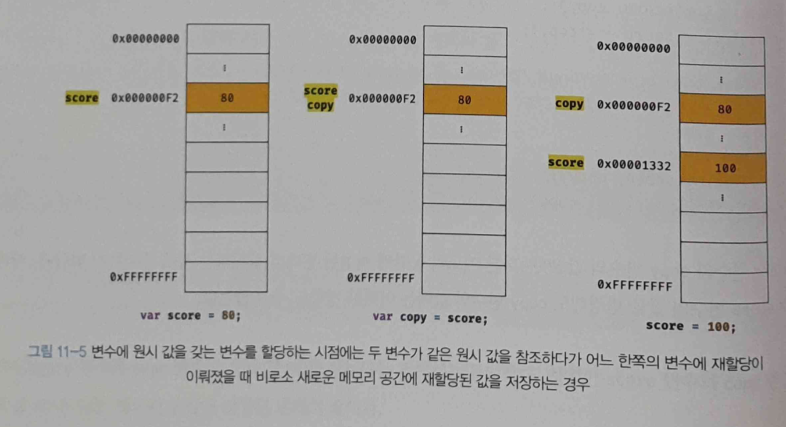
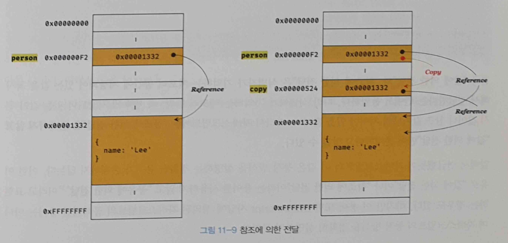

# 11장 원시 값과 객체의 비교

JS가 제공하는 숫자, 문자열, 불리언, null, undefined, 심벌, 객체 타입의 7가지 데이터 타입은 크게 원시 타입과 객체 타입으로 구분할 수 있다.

두 가지 데이터 타입으로 구분된 원시 타입과 객체 타입은 근본적으로 세 가지 측면에서 다르다.

- **원시 타입의 값, 즉 원시 값은 변경 불가능한 값(immutable value)** 이다. 이에 비해 **객체(참조) 타입의 값, 즉 객체는 변경 가능한 값(mutable value)** 이다.
- **원시 값을 변수에 할당하면 변수(확보된 메모리 공간)에는 실제 값이 저장** 된다. 이에 비해 **객체를 변수에 할당하면 변수(확보된 메모리 공간)에는 참조 값이 저장** 된다.
- 원시 값을 갖는 변수를 다른 변수에 할당하면 원본의 **원시 값이 복사되어 전달** 된다. 이를 **값에 의한 전달(pass by value)** 이라 한다. 이에 비해 객체를 가리키는 변수를 다른 변수에 할당하면 원본의 **참조 값이 복사되어 전달**된다. 이를 **참조에 의한 전달(pass by reference)** 이라 한다.

# 11.1 원시 값

## 11.1.1 변경 불가능한 값

원시 타입(primitive type)의 값, 즉 원시 값은 변경 불가능한 값(immutable value)이다.

한번 생성된 원시 값은 읽기 전용(read only) 값으로서 변경할 수 없다.

**변경 불가능하다는 것은 변수가 아니라 값(원시 값)에 대한 진술이다.**

변수는 언제든지 재할당을 통해 변수 값을 변경(교체)할 수 있다.

상수도 변수다. 하지만 상수는 할당이 한 번만 허용되므로 변수 값을 변경할 수 없다.

상수는 재할당이 금지된 변수이다.

### 예제 11-01

```jsx
// const 키워드를 사용해 선언한 변수는 재할당이 금지된다. 상수는 재할당이 금지된 변수일 뿐이다.
const o = {};

// const 키워드를 사용해 선언한 변수에 할당한 원시값(상수)은 변경할 수 없다.
// 하지만 const 키워드를 사용해 선언한 변수에 할당한 객체는 변경할 수 있다.
o.a = 1;
console.log(o); // {a: 1}
```

원시 값은 변경 불가능한 값이자 읽기 전용 값이다.

이러한 원시 값의 특성은 데이터의 신뢰성을 보장한다.

JS 엔진은 원시 값을 할당된 변수에 새로운 원시 값을 재할당할 때 메모리에 할당된 원시 값을 새로운 원시 값으로 바꾸지 않는다.

새로 할당한 메모리 공간에 재할당하려는 원시 값을 저장한 후, 변수가 새롭게 재할당한 원시 값을 가리키도록 한다.

변수 값을 변경하기 위해 원시 값을 재할당하면 새로운 메모리 공간을 확보하고 재할당한 값을 저장한 후, 변수가 참조하던 메모리 공간의 주소를 변경한다.

값의 이러한 특성을 **불변성(immutability)** 이라고 한다.

**불변성을 갖는 원시 값을 할당한 변수는 재할당 이외에 변수 값을 변경할 수 있는 방법이 없다.**

## 11.1.2 문자열과 불변성

문자열은 0개 이상의 문자(character)로 이루어진 집합을 말하며, 1개의 문자는 2바이트의 메모리 공간에 저장된다. 따라서 문자열은 몇 개의 문자로 이루어졌느냐에 따라 필요한 메모리 공간의 크기가 저장된다.

### 예제 11-02

```jsx
// 문자열은 0개 이상의 문자들로 이뤄진 집합이다.
var str1 = ""; // 0개의 문자로 이뤄진 문자열(빈 문자열)
var str2 = "Hello"; // 5개의 문자로 이뤄진 문자열
```

JS의 장점 중 하나는 개발자의 편의를 위해 원시 타입으로서 문자열 타입을 제공한다는 점이다.

JS의 문자열은 원시 타입이기 때문에 변경 불가능하다.

### 예제 11-03

```jsx
var str = "Hello";
str = "world";
```

- 첫 번째 문 실행
  1. 문자열 `'Hello'` 생성
  2. 식별자 `str`은 문자열 `'Hello'`가 저장된 메모리 공간의 첫 번째 메모리 셀 주소를 가리킴
- 두 번째 문 실행
  1. 새로운 문자열 `'world'` 생성
  2. 식별자 `str`은 문자열 `'world'`를 가리킴
- `'Hello'` 와 `'world'` 는 모두 메모리에 존재함
- 식별자 str은 문자열 `'Hello'` 을 가리키고 있다가 문자열 `'world'` 을 가리키도록 변경된 것임

문자열은 유사 배열 객체이면서 이터러블이므로 배열과 유사하게 각 문자에 접근할 수 있다.

- 유사 배열 객체
  유사 배열 객체란 마치 배열 처럼 인덱스로 프로퍼티 값에 접근할 수 있고 `length` 프로퍼티를 갖는 객체를 말한다. 문자열은 마치 배열처럼 인덱스를 통해 각 문자에 접근할 수 있으며, `length` 프로퍼티를 갖기 때문에 유사 개열 객체이고 `for`문으로 순회할 수 있다.

  ### 예제 11-04

  ```jsx
  var str = "string";

  // 문자열은 유사 배열이므로 배열과 유사하게 인덱스를 사용해 각 문자에 접근할 수 있다.
  console.log(str[0]); // s

  // 원시 값인 문자열이 객체처럼 동작한다.
  console.log(str.length); // 6
  console.log(str.toUpperCase()); // STRING
  ```

하지만 문자열의 한 문자를 변경할 수는 없다.

### 예제 11-05

```jsx
var str = "string";

// 문자열은 유사 배열이므로 배열과 유사하게 인덱스를 사용해 각 문자에 접근할 수 있다.
// 하지만 문자열은 원시값이므로 변경할 수 없다. 이때 에러가 발생하지 않는다.
str[0] = "S";

console.log(str); // string
```

문자열은 변경 불가능한 값이기 때문에 이미 생성된 문자열의 일부 문자는 변경할 수 없다.

한번 생성된 문자열은 읽기 전용 값으로 변경할 수 없다.

예기치 못한 변경으로부터 자유로워 데이터의 신뢰성이 보장된다.

변수에 새로운 문자열을 재할당하는 것은 물론 가능하다.

## 11.1.3 값에 의한 전달

### 예제 11-06

```jsx
var score = 80;
var copy = score;

console.log(score); // 80
console.log(copy); // 80

score = 100;

console.log(score); // 100
console.log(copy); // ?
```

변수에 변수를 할당했을 때 무엇이 어떻게 할당되는가?

값에 의한 전달(`call-by-value`)가 일어난다.

`copy = score`에서 `score`는 변수 값 `80`으로 평가되므로 `copy` 변수에도 `80`이 할당될 것이다. 이때 새로운 숫자 값 `80`이 생성되어 `copy` 변수에 할당된다.

### 예제 11-07

```jsx
var score = 80;

// copy 변수에는 score 변수의 값 80이 복사되어 할당된다.
var copy = score;

console.log(score, copy); // 80  80
console.log(score === copy); // true
```

예제 11-07에서 `score` 변수와 `copy` 변수는 동일하게 숫자 값 `80`을 갖는다.

하지만 `score` 변수와 `copy` 변수의 값 `80`은 다른 메모리 공간에 저장된 별개의 값이다.



### 예제 11-08

```jsx
var score = 80;

// copy 변수에는 score 변수의 값 80이 복사되어 할당된다.
var copy = score;

console.log(score, copy); // 80  80
console.log(score === copy); // true

// score 변수와 copy 변수의 값은 다른 메모리 공간에 저장된 별개의 값이다.
// 따라서 score 변수의 값을 변경해도 copy 변수의 값에는 어떠한 영향도 주지 않는다.
score = 100;

console.log(score, copy); // 100  80
console.log(score === copy); // false
```

score 변수와 copy 변수의 값 80은 다른 메모리에 저장된 별개의 값이다. 따라서 score 변수의 값을 변경해도 copy 변수의 값에는 변함이 없다.

값에 의한 전달

- 공유에 의한 전달이라고 표현하는 경우도 있음
- 변수와 같은 식별자는 값이 아니라 메모리 주소를 기억하기 때문에 엄격하게 표현하면 변수에는 값이 전달되는 것이 아니라 메모리 주소가 전달된다.

식별자

- 식별자는 어떤 값을 구별해서 식별해낼 수 있는 고유한 이름
- 변수와 같은 식별자는 값이 아니라 메모리 주소를 기억하고 있음
- 식별자는 메모리 주소에 붙인 이름으로 식별자가 기억하고 있는 메모리 주소를 통해 메모리 공간에 저장된 값에 접근할 수 있다.

### 예제 11-09

```jsx
var x = 10;
```

할당 연산자는 숫자 리터럴 10에 의해 생성된 숫자 값 10이 저장된 메모리 공간의 주소를 전달한다. 이로써 식별자 `x`는 메모리 공간에 저장된 숫자 값 10을 식별할 수 있다.

### 예제 11-10

```jsx
var copy = score;
```

score는 식별자 표현식으로서 숫자 값 80으로 평가되는데, 이 때 두 가지 평가 방식이 가능하다.

1. 새로운 80을 생성(복사)해서 메모리 주소를 전달하는 방식. 이 방식은 할당 시점에 두 변수가 기억하는 메모리 주소가 다르다.

   

2. score의 변수값 80의 메모리 주소를 그대로 전달하는 방식. 이 방식은 할당 시점에 두 변수가 기억하는 메모리 주소가 같다.

   

**이 처럼 “값에 의한 전달"도 사실은 값을 전달하는 것이 아니라 메모리 주소를 전달한다. 단, 전달된 메모리 주소를 통해 메모리 공간에 접근하면 값을 참조할 수 있다.**

중요한 것은 변수에 원시 값을 갖는 변수를 할당하면 변수 할당 시점이든, 두 변수 중 어느 하나의 변수에 값을 재할당하는 시점이든 **결국은 두 변수의 원시 값은 서로 다른 메모리 공간에 저장된 별개의 값이 되어 어느 한쪽에서 재할당을 통해 값을 변경하더라도 서로 간섭할 수 없다**는 것이다.

# 11.2 객체

객체는 복합적인 자료구조이다.

원시 값은 상대적으로 적은 메모리를 소비하지만 객체는 경우에 따라 크기가 매우 클 수도 있다.

객체를 생성하고 프로퍼티에 접근하는 것도 원시 값과 비교할 때 비용이 많이 드는 일이다.

따라서 객체는 원시 값과는 다른 방식으로 동작하도록 설계되어 있다.

- 자바스크립트 객체의 관리 방식 → 히든 클래스
  자바스크립트 객체는 프로퍼티 키를 인덱스로 사용하는 해시 테이블이라고 생각할 수 있다. 대부분의 자바스크립트 엔진은 해시 테이블과 유사하지만 높은 성능을 위해 일반적인 해시 테이블보다 나은 방법으로 객체를 구현한다.
  자바스크립트는 클래스 없이 객체를 생성할 수 있으며 객체가 생성된 이후라도 동적으로 프로퍼티와 메서드를 추가할 수 있다. 이는 사용하기 매우 편리하지만 성능 면에서는 이론적으로 클래스 기발 객체 프로그래밍 언어의 객체보다 생성과 프로퍼티 접근에 비용이 더 많이 드는 비효율적인 방식이다.
  V8 자바스크립트 엔진에서는 프로퍼티에 접근하기 위해 동적 탐색(dynamic lookup) 대신 **히든 클래스(hidden class)** 라는 방식을 이용해 C++ 객체의 프로퍼티에 접근하는 정도의 성능을 보장한다.

## 11.2.1 변경 가능한 값

**객체(참조) 타입의 값, 즉 객체는 변경 가능한 값(mutable value)** 이다.

### 예제 11-11

```jsx
var person = {
  name: "Lee",
};
```

원시 값이 할당된 변수

- 원시 값이 할당된 변수가 기억하는 메모리 주소가 가리키는 메모리 공간에 접근하면 원시 값에 접근할 수 있다.
- 원시 값이 할당된 변수는 원시 값 자체를 값으로 갖는다.
- 원시 값을 할당한 변수를 참조하면 메모리에 저장되어 있는 원시 값에 접근한다.

객체가 할당된 변수

- 하지만 객체에 할당된 변수가 기억하는 메모리 주소가 가리키는 메모리 공간에 접근하면 **참조 값(reference value)** 에 접근할 수 있다.
- **참조 값**은 생성된 객체가 저장된 메모리 공간의 주소, 그 자체다.
- 객체를 할당한 변수를 참조하면 메모리에 저장되어 있는 참조 값을 통해 실제 객체에 접근한다.

### 예제 11-12

```jsx
// 할당이 이뤄지는 시점에 객체 리터럴이 해석되고, 그 결과 객체가 생성된다.
var person = {
  name: "Lee",
};

// person 변수에 저장되어 있는 참조값으로 실제 객체에 접근해서 그 객체를 반환한다.
console.log(person); // {name: "Lee"}
```

원시 값을 할당한 변수

- “변수는 0 값을 갖는다” 또는 “변수의 값은 0다"라고 표현함

객체를 할당한 변수

- “변수는 객체를 참조하고 있다" 또는 “변수는 객체를 가리키고(point) 있다"라고 표현함

예제 11-12에서 `person` 변수는 객체 `{ name: ‘Lee’ }`를 가리키고(참조하고) 있다.

### 예제 11-13

```jsx
var person = {
  name: "Lee",
};

// 프로퍼티 값 갱신
person.name = "Kim";

// 프로퍼티 동적 생성
person.address = "Seoul";

console.log(person); // {name: "Kim", address: "Seoul"}
```

원시 값

- 변경 불가능한 값이므로 원시 값을 갖는 변수의 값을 변경하려면 재할당 외에는 방법이 없다.

**객체**

- **객체는 변경 가능한 값이다.**
- **객체를 할당한 변수는 재할당 없이 객체를 직접 변경할 수 있다.**
- **재할당 없이 프로퍼티를 동적으로 추가할 수도 있고 프로퍼티 값을 갱신할 수도 있으며 프로퍼티 자체를 삭제할 수도 있다.**
- 이때 객체를 할당한 변수에 재할당을 하지 않았으므로 객체를 할당한 변수의 참조 값은 변경되지 않는다.

객체는 변경 가능한 값으로 설계되어 있다.

- 메모리를 효율적으로 사용하기 위해
- 객체를 복사해 생성하는 비용을 절약하여 성능을 향상시키기 위해
- 메모리 사용의 효율성과 성능을 위해 어느 정도의 구조적인 단점을 감안한 설계이다.

객체의 구조적 단점에 따른 부작용

- 원시 값과는 다르게 **여러 개의 식별자가 하나의 객체를 공유할 수 있다.**
- 얕은 복사(shallow copy)와 깊은 복사(deep copy)
  객체를 프로퍼티 값으로 갖는 경우

  - 얕은 복사: 한 단계까지만 복사하는 것
  - 깊은 복사: 객체에 중첩되어 있는 객체까지 모두 복사하는 것

  ### 예제 11-14

  ```jsx
  const o = { x: { y: 1 } };

  // 얕은 복사
  const c1 = { ...o }; // 35장 "스프레드 문법" 참고
  console.log(c1 === o); // false
  console.log(c1.x === o.x); // true

  // lodash의 cloneDeep을 사용한 깊은 복사
  // "npm install lodash"로 lodash를 설치한 후, Node.js 환경에서 실행
  const _ = require("lodash");
  // 깊은 복사
  const c2 = _.cloneDeep(o);
  console.log(c2 === o); // false
  console.log(c2.x === o.x); // false
  ```

  앝은 복사와 깊은 복사로 생성된 객체는 원본과 참조 값이 다른 별개의 객체다.
  객체에 중첩되어 있는 객체를 복사할 때

  - 얕은 복사하는 경우: 참조 값만 복사함
  - 깊은 복사하는 경우: 객체에 중첩되어 있는 객체까지 모두 복사해서 원시 값처럼 완전한 복사본은 만듦

  ### 예제 11-15

  ```jsx
  const v = 1;

  // "깊은 복사"라고 부르기도 한다.
  const c1 = v;
  console.log(c1 === v); // true

  const o = { x: 1 };

  // "얕은 복사"라고 부르기도 한다.
  const c2 = o;
  console.log(c2 === o); // true
  ```

  참고: 얕은 복사와 깊은 복사가 다르게 불리는 경우

  - 깊은 복사: 원시 값을 할당한 변수를 다른 변수에 할당하는 것
    - 원시 값을 복사?
  - 얕은 복사: 객체를 할당한 변수를 다른 변수에 할당하는 것
    - 참조 값은 복사?

## 11.2.2 참조에 의한 전달

여러 개의 식별자가 하나의 객체를 공유할 수 있다는 것의 의미는 무엇일까?

- 참조 값을 이용하면 다른 두 개의 변수가 같은 객체를 가리킬 수 있다?

이로 인해 어떤 부작용이 발생할까?

- 객체를 공유하는 여러 개 식별자 중 하나의 식별자에서 객체를 변경하면 다른 식별자에도 반영이 된다.

### 예제 11-16

```jsx
var person = {
  name: "Lee",
};

// 참조값을 복사(얕은 복사)
var copy = person;
```

참조에 의한 전달: 객체를 가리키는 변수(원본, `person`)를 다른 변수(사본, `copy`)에 할당하면 원본의 참조 값이 복사되어 전달됨



원본 `person`을 사본 `copy`에 할당하면 원본 `person`의 참조 값이 `copy`에 복사되어 저장된다.

원본 `person`과 사본 `copy`가 저장된 메모리 주소는 다르지만 각 변수의 참조 값은 같다.

원본 `person`과 사본 `copy`는 모두 동일한 객체를 가리킨다.

이것이 **두 개의 식별자가 하나의 객체를 공유한다**는 것을 의미한다.

따라서 원본 또는 사본 중 어느 한쪽에서 객체를 변경(변수에 새로운 객체를 재할당 하는 것이 아니라 객체의 프로퍼티 값을 변경하거나 프로퍼티를 추가, 삭제)하면 서로 영향을 주고 받는다.

### 예제 11-17

```jsx
var person = {
  name: "Lee",
};

// 참조값을 복사(얕은 복사). copy와 person은 동일한 참조값을 갖는다.
var copy = person;

// copy와 person은 동일한 객체를 참조한다.
console.log(copy === person); // true

// copy를 통해 객체를 변경한다.
copy.name = "Kim";

// person을 통해 객체를 변경한다.
person.address = "Seoul";

// copy와 person은 동일한 객체를 가리킨다.
// 따라서 어느 한쪽에서 객체를 변경하면 서로 영향을 주고 받는다.
console.log(person); // {name: "Kim", address: "Seoul"}
console.log(copy); // {name: "Kim", address: "Seoul"}
```

“값에 의한 전달” vs “참조에 의한 전달"

- **식별자가 기억하는 메모리 공간에 저장되어 있는 값을 복사해서 전달한다는 면에서 동일**
- 변수(식별자가 기억하는 메모리 공간)에 저장되어 있는 값
  - 값에 의한 전달 → 원시 값
  - 참조에 의한 전달 → 참조 값
- **따라서 JS에는 “참조에 의한 전달"은 존재하지 않고 “값에 의한 전달"만 존재한다.**

### 예제 11-18

```jsx
var person1 = {
  name: "Lee",
};

var person2 = {
  name: "Lee",
};

console.log(person1 === person2); // ①
console.log(person1.name === person2.name); // ②
```

객체 리터럴은 참조 값을 반환하는데 평가될 때마다 객체를 생성하므로 `person1`과 `person2`의 참조 값은 다르다.

하지만 프로퍼티는 원시 값으로 평가되므로 `person1.name`과 `person2.name`은 `‘Lee’`로 같다.

①: `false`

②: `true`
